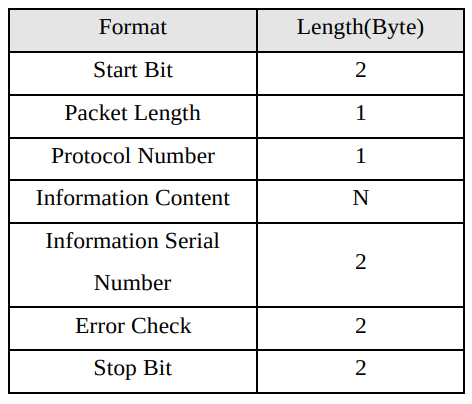
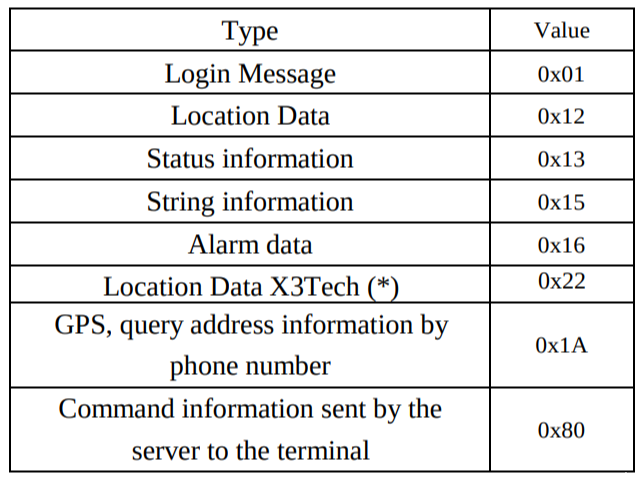
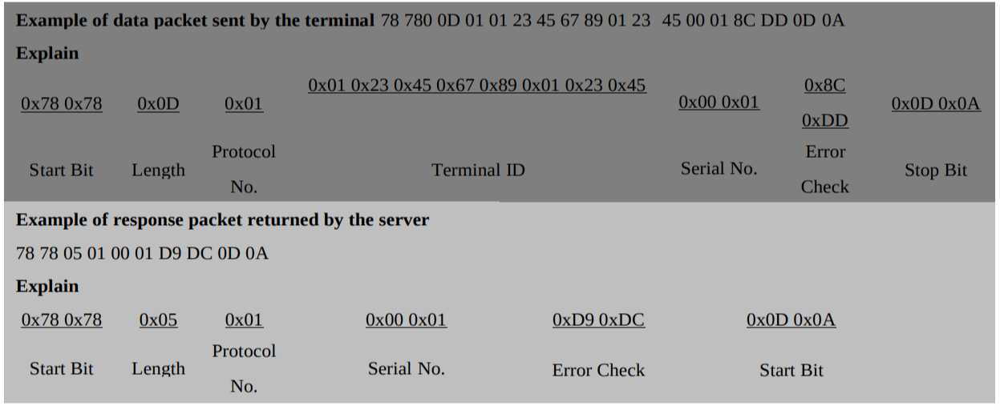
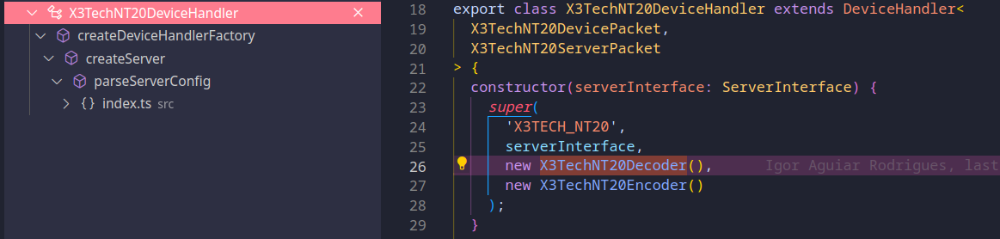
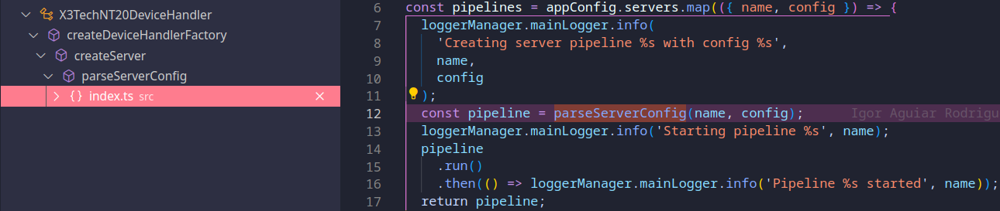
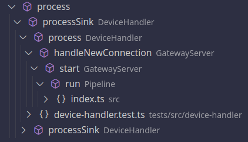
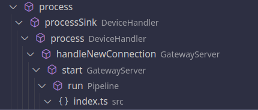
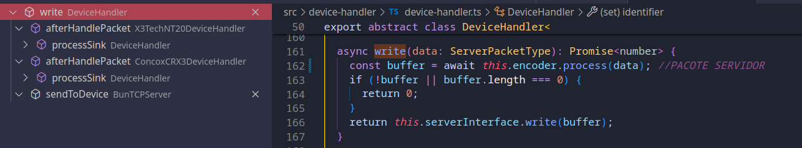

# 📦 NT20 Device Gateway — Documentação Técnica

## 🏃 Execução de Scripts

### Inicialização do Pipeline NT20

```bash
bun run src/index.ts
pnpm start:nt20-device-simulator
```

- Início pelo script `start()`
  - `(1040938): Starting pipeline NT20`
  - `(BunTCPServer[NT20/6666]/1040938)`

### Execução de Testes

```bash
bun test tests/devices/x3tech-nt20/handler/decoder.test.ts
bun test --watch tests/devices/x3tech-nt20/handler/decoder.test.ts
bun test ./tests/devices/x3tech-nt20/transformer/new-navigation-to-gprs-message-received.test.ts
```

---

## 🔌 Conexões

### Eventos do `BunServerConnection`

`BunServerConnection` estende `GatewayServerConnection` com os seguintes eventos:

- `closed: [conn: GatewayServerConnection]`
- `data: [conn: GatewayServerConnection, data: Buffer]`
- `packet: [conn: GatewayServerConnection, packet: DevicePacket]`

Após isso, `cb(null, connection)` callback da conexão feita para o startServer

---

## 🔁 Linha de Funcionamento

### Pipeline NT20

```bash
bun run src/index.ts
```

#### index.ts -> const pipelines = appConfig.servers.map

```js
[2024-05-29 13:22:03.825 +0000] INFO (1743850): Creating server pipeline NT20 with config SERVER:BUN_TCP_SERVER(6666,NT20);TRANSFORMER:GPRS_MESSAGE_RECEIVED;PUBLISHER:JSON_DIRECTORY(/home/dionatasb/tmp/nt20-packets)
[2024-05-29 13:22:03.826 +0000] INFO (1743850): Starting pipeline NT20
```

#### index.ts -> loggerManager.mainLogger.info('Starting pipeline %s', name);

- #### src > index.ts -> const pipelines = appConfig.servers.map(({ name, config }) =>

  ```js
  [2024-05-29 13:22:03.825 +0000] INFO (1743850): Creating server pipeline NT20 with config SERVER:BUN_TCP_SERVER(6666,NT20);TRANSFORMER:GPRS_MESSAGE_RECEIVED;PUBLISHER:JSON_DIRECTORY(/home/dionatasb/tmp/nt20-packets)
  [2024-05-29 13:22:03.826 +0000] INFO (1743850): Starting pipeline NT20
  ```

  - #### pipeline.run()

    - **src > pipeline.ts > Pipeline > run**

            return this.server.**start()**.then(async () => {...

    - **src > server > index.ts > GatewayServer > start(BunTCPServer)**

    - #### async start()

      - ```js
        this.log.info('start - starting');
        [2024-05-29 13:22:03.826 +0000] INFO (BunTCPServer[NT20/6666]/1743850): start - starting
        ```
      - **src > http-interface > index.ts > HttpInterfaceServer > start (HttpInterfaceServer)**
      - ```js
        this.log.info('start - calling startServer');
        [2024-05-29 14:59:27.025 +0000] INFO (BunTCPServer[NT20/6666]/1801470): start - calling startServer
        ```
      - #### await _this_.startServer(async (err, connection) => {
        - **src > server > bun > index.ts > BunTCPServer > startServer (BunTCPServer)**
        - protected async startServer(
          - ```js
            this.log.info('Listening on %s:%d', this.server.hostname, this.server.port);
            [2024-05-29 14:59:27.025 +0000] INFO (BunTCPServer[NT20/6666]/1801470): Listening on 0.0.0.0:6666
            ```
        ```js
        this.log.info('start - startServer called. Iterating over connections');
        [2024-05-29 14:59:27.025 +0000] INFO (BunTCPServer[NT20/6666]/1801470): Listening on 0.0.0.0:6666
        ```
      - _this_.logActiveConnections();

        - **src > server > index.ts > GatewayServer > logActiveConnections (BunTCPServer)**
        - protected async logActiveConnections() {
        - ```js
           this.log.info('identifiedConnections: %d, unidentifiedConnections: %d', this.identifiedConnections.size, this.unidentifiedConnections.size);
           [2024-05-29 14:59:27.025 +0000] INFO (BunTCPServer[NT20/6666]/1801470): identifiedConnections: 0, unidentifiedConnections: 0
          ```

        **src > pipeline.ts > Pipeline > run > then() callback**

      ```js
      this.log.info('server started');
      [2024-05-29 14:59:27.026 +0000] INFO (Pipeline[NT20]/1801470): server started
      ```

      - Aqui é um log contendo as estatísticas das mensagens recebidas
        ```js
        setInterval(() => {
        this.log.info('Statistic: %j', this.stats);
        this.log.info('Queues: %j', {
        transform: this.transformQueue.length(),
        mainPublisher: this.mainPublisherQueue.length(),        	fallbackPublisher: this.fallbackPublisherQueue.length(),});
        ```

    - #### pipeline.run().then()

    ```js
    then(() => loggerManager.mainLogger.info('Pipeline %s started', name));
    [2024-05-29 15:55:31.775 +0000] INFO (1837586): Pipeline NT20 started
    ```

  - await _this_.startServer(async (err, connection) => {
  - **src > server > bun > index.ts > BunTCPServer > startServer (BunTCPServer)**
  - protected async startServer(
    - ```js
      this.log.info('Listening on %s:%d', this.server.hostname, this.server.port);
      [2024-05-29 14:59:27.025 +0000] INFO (BunTCPServer[NT20/6666]/1801470): Listening on 0.0.0.0:6666
      ```
    - **src > http-interface > index.ts > HttpInterfaceServer > start (HttpInterfaceServer)**
      - Aqui contém um socket que fica "ouvindo" a conexão:
        - ```js
          new HttpInterfaceServer(
            "0.0.0.0",
            appConfig.httpServer.port,
            pipelines
          ).start();
          ```
        - ```js
          this.log.info(
             'start - starting HttpInterfaceServer at http://%s:%s',
              this.hostname,
              this.port
              );
          [2024-05-29 13:22:03.826 +0000] INFO (HttpInterfaceServer/1743850): start - starting HttpInterfaceServer at http://0.0.0.0:3030
          ```

---

## Pacotes descartados

- Erro no publisher (exeption)
  - ```js
    this.log.exception(
      asError(err),
      `Packet discarded - Fallback publisher error: deviceTypeName=${
        item.deviceTypeName
      }, identifier=${item.identifier ?? "?"}, data=${JSON.stringify(
        item.data
      )}`
    );
    ```
- Sem identificação (warn)
  - ```js
    this.log.warn(
      "Packet discarded: not identified: deviceTypeName=%s, identifier=%s, packet=%j",
      deviceTypeName,
      record.identifier ?? "?",
      packet
    );
    ```
- Transformador não consegue lidar com pacotes (debug)
  - ```js
    this.log.debug(
      "Packet discarded: Transformer can not handle packet: deviceTypeName=%s, identifier=%s, packet=%j",
      deviceTypeName,
      record.identifier ?? "?",
      packet
    );
    ```
- Nenhum fallback configurado (warn)
  - ```js
    this.log.warn(
      "Packet discarded: No fallback configured: deviceTypeName=%s, identifier=%s, data=%j",
      deviceTypeName,
      identifier ?? "?",
      data
    );
    ```

---

## Oque ocorre quando há uma conexão:

- (BunTCPServer[NT20/6666]/39250) ~ Conexão inicial
  collapsed:: true
  - " open - new connection: 127.0.0.1"
  - " handleNewConnection " inicia o record vazio (inicializa)
  - o arquivo data é inserido no record
  - emite o packet para o servidor (Device Packet)
  - seta a conexão identificada: GatewayServerConnectionRecord
  - log de conexões ativas:
    - ```js
      if (await this.isStarted()) {
          this.log.info(
          'identifiedConnections: %d, unidentifiedConnections: %d',
          this.identifiedConnections.size,
          this.unidentifiedConnections.size
        );
      ```
- (Pipeline[NT20]/60479) ~Estastísticas
  collapsed:: true
  - Dentro da função **run()** do Pipeline, há um log de estatísticas:
    - ```js
      this.log.info("server started");
      setInterval(() => {
        this.log.info("Statistic: %j", this.stats);
        this.log.info("Queues: %j", {
          transform: this.transformQueue.length(),
          mainPublisher: this.mainPublisherQueue.length(),
          fallbackPublisher: this.fallbackPublisherQueue.length(),
        });
      }, appConfig.log.pipeline.statisticsInterval);
      ```
- (Pipeline[NT20]/39250) ~Descarte
  collapsed:: true

  - Descarte do pacote de login

    - ```bash
      open {
        id: 1,
        imei: "0357789640330000",
        lastSeen: 1717423459341,
      } 1


      0357789640330000 sending  78780d01035778964033000000030c770d0a
      0357789640330000 received 787805010003face0d0a

      ```

    - ```js
      [2024-06-03 13:29:10.051 +0000] DEBUG (Pipeline[NT20]/39250):
      Packet discarded: Transformer can not handle packet: deviceTypeName=X3TECH_NT20,
        identifier=0357789640330000,
        packet={"protocolNumber":1,
        		  "terminalId":"0357789640330000",
        		  "serialNumber":3,
                "crc":3191,
                "rawData":{"type":
                           "Buffer",
                           "data":[120,120,13,1,3,87,120,150,64,51,0,0,0,3,12,119,13,10]},
                "serverTime":1717421350050,
                "model":
                "NT20"}
      ```

---

## DOCUMENTAÇÃO:

- Formato dos dados:
  collapsed:: true
  - N = 8
  - 
  - Dados
    - De início: Fixed value in HEX 0x78 0x78.
    - Tamanho do pack
      - Length = Protocol Number + Information Content + Information Serial Number + Error Check,
        totally (5+N)Bytes, because the Information Content is a variable length field.
    - Protocolo:
      - 
    - Bit de parada : Fixed value in HEX 0x0D 0x0A.
- Tamanho igual a 32 bits ?
- Para o tamanho do pack conta: protocol number + ID + serial number + error check
- Envio e Resposta:
  - Envio:
    - Ex: 78780d01035778964033000000030c770d0a
    - x078 0x78 ~ 2 bytes -> bytes de início
    - x0d ~ 1 byte -> tamanho do packet (13)
    - x01 ~ 1 byte -> número de protocolo -? 1
    - x03 x57 x78 x96 x40 x33 x00 x00 ~ ID ( N = ~22) -? 8
    - x00 x03 ~ 2 bytes -> Número serial -? 2
    - 0x00 0xDD ~ 2 bytes -> verificação de erro -? 2
    - x0d x0a ~ 2 bytes -> bytes de parada
  - Resposta:
    - Ex: 787805010003face0d0a
      - x78x78 = start bit
      - x05 = lengh number
      - x01 = protocol number
      - x00 x03 = serial number
      - xFA xCE = check erro
      - x0D x0A = start byte
    -
  - 

---

## SERVE INTERFACE

- 
- 
- ParserServerConfig()
  - ```js
    export function parseServerConfig(name: string, cfg: string) {
      const builder = cfg
        .trim()
        .split(";")
        .reduce((builder, componentStr) => {
          const [componentType, componentCfg] = componentStr.split(":");
          switch (componentType) {
            case "SERVER":
              const server = createServer(name, componentCfg);
              builder.server(server);
              break;
            case "TRANSFORMER":
              const transformer = createTransformer(componentCfg);
              builder.transformer(transformer);
              break;
            case "PUBLISHER":
              const publisher = createPublisher(componentCfg);
              builder.publisher(publisher);
              break;
            case "FALLBACK_PUBLISHER":
              const fallbackPublisher = createPublisher(componentCfg);
              builder.fallbackPublisher(fallbackPublisher);
              break;
          }
          return builder;
        }, new PipelineBuilder().name(name));
      return builder.build();
    }
    ```
- createServer()
  collapsed:: true
  - ```js
    function createServer(name: string, componentCfg: string) {
      const bunMatch = componentCfg.match(BUN_TCP_SERVER_REGEX);
      if (bunMatch) {
        const port = Number(bunMatch[1]);
        if (isNaN(port)) {
          throw new Error(`Invalid port for server config "${componentCfg}"`);
        }
        const handler = createDeviceHandlerFactory(bunMatch[2]);
        return new BunTCPServer(name, handler, port);
      }
      throw new Error(`Server not found for config "${componentCfg}"`);
    }
    ```
- createDeviceHandleFactory()
  collapsed:: true
  - ```js
    function createDeviceHandlerFactory(
      deviceType: string
    ): DeviceHandlerFactory<DevicePacket, any> {
      switch (deviceType) {
        case "NT20": {
          return async (conn) => new X3TechNT20DeviceHandler(conn);
          break;
        }
        case "CRX3": {
          return async (conn) => new ConcoxCRX3DeviceHandler(conn);
          break;
        }
        default: {
          throw new Error(
            `Device handler not found for device type "${deviceType}"`
          );
        }
      }
    }
    ```
- X3TechNT20DeviceHandler ~ new X3TechNT20Decoder()

  - ```js
    export class X3TechNT20DeviceHandler extends DeviceHandler<
      X3TechNT20DevicePacket,
      X3TechNT20ServerPacket
    > {
      constructor(serverInterface: ServerInterface) {
        super(
          'X3TECH_NT20',
          serverInterface,
          new X3TechNT20Decoder(),
          new X3TechNT20Encoder()
        );
      }
    ```

  - ### **DECODER (DECODIFICADOR ~X3TechNT20Decoder)**
  - ```js
    export class X3TechNT20Decoder extends AbstractDelimitedMessageDecoder<
    X3TechNT20DevicePacket,
    X3TechNT20DeviceProtocol
    > {
    public static readonly FRAME_TYPES = Uint8Array.from(DEVICE_PROTOCOLS);
    - static readonly FRAME_PREAMBLE_01 = Uint8Array.of(0x78, 0x78);
    static readonly FRAME_PREAMBLE_02 = Uint8Array.of(0x79, 0x79);
    - constructor() {
      super(
        [
          {
            start: X3TechNT20Decoder.FRAME_PREAMBLE_01,
            stop: Uint8Array.of(0x0d, 0x0a),
          },
          {
            start: X3TechNT20Decoder.FRAME_PREAMBLE_02,
            stop: Uint8Array.of(0x0d, 0x0a),
          },
        ],
        5
      );
    }
    ```
  - Decoder (decodifica oque vem do rastreador):

    - Iniciação do decoder
      collapsed:: true
      ```js
      export interface IDecoder<P extends DevicePacket> {
        process(
          data: ArrayBufferLike,
          serverTime: number
        ): AsyncGenerator<
          P,
          Array<{ frameStartIndex: number; frameEndIndex: number }>
        >;
        // on(ev: "identifier", cb: (identifier: DeviceIdentifier) => void): void;
        // on(ev: "response", cb: (packet: R) => void): void;
      }
      ```
      - 
        - ProcessSink (DeviceHandler) ~ const generator = _this_.decoder.process...
          - Process (DeviceHandler) ~async process(data: Buffer)..
            - handleNewConnection (GatwayServer) ~await record.handler.process(data)..
              - start (GatwayServer) ~wait _this_.handleNewConnection(connection)...
                - run (pipeline) ~return _this_.server.start()...
                  - index.ts (src) ~run
    - ### Hierarquia:

      - 
      - ProcessSink (Device Handler)
        collapsed:: true

        - ```js
            protected async processSink() {
              const buffer = this.sink.flush() as ArrayBuffer;
              const generator = this.decoder.process(buffer, Date.now());
              let item:
                | IteratorResult<
                    DevicePacketType,
                    Array<{ frameStartIndex: number; frameEndIndex: number }>
                  >
                | undefined = undefined;
              while (!(item = await generator.next()).done) {
                const shouldHandle = await this.beforeHandlePacket(item.value);
                if (!shouldHandle) {
                  continue;
                }
                if (this.identifier) {
                  await this.serverInterface
                    .handlePacket(item.value)
                    .catch((err) =>
                      this.log.exception(asError(err), `Error handling packet`)
                    );
                }
                await this.afterHandlePacket(item.value);
              }
              const consumedRanges = item.value;
              let start = 0;
              consumedRanges.forEach((r) => {
                this._sinkBufferSize -= r.frameEndIndex - r.frameStartIndex;
                this.sink.write(buffer.slice(start, r.frameStartIndex));
                start = r.frameEndIndex;
              });
              this.sink.write(buffer.slice(start));
              if (start > 0) {
                await this.processSink();
              }
            }
          ```

          - ### 1. Extrair o Buffer do Sink
            - Em buffer, extrai um buffer de dados do "sink", onde o flush() esvazia o conteúdo atual do sink e retorna os dados como um `ArrayBuffer`.
              - ```js
                const buffer = this.sink.flush() as ArrayBuffer;
                ```
          - ### 2. Processar o Buffer com o Decoder
            Aqui, o buffer é passado para o método `process` do decodificador (`decoder`), que retorna um gerador. Esse gerador vai produzir pacotes de dados processados.
            - ```js
              const generator = this.decoder.process(buffer, Date.now());
              ```
          - ### 3. Iterar sobre os Pacotes Gerados

            - Aqui, o código itera sobre os pacotes gerados pelo decodificador. Para cada pacote:

              - `beforeHandlePacket`: Verifica se o pacote deve ser processado.
              - Se deve ser processado e `this.identifier` está definido, no `serverInterface` chama `handlePacket` para processar/ emitir os pacotes.
              - `serverInterface`: em sua estrutura ele escreve o buffer e o identificador de Pacote
              - Chama `afterHandlePacket` depois de processar o pacote.

                - ```js
                  let item:
                    | IteratorResult<
                        DevicePacketType,
                        Array<{
                          frameStartIndex: number,
                          frameEndIndex: number,
                        }>
                      >
                    | undefined = undefined;

                  while (!(item = await generator.next()).done) {
                    const shouldHandle = await this.beforeHandlePacket(
                      item.value
                    );
                    if (!shouldHandle) {
                      continue;
                    }
                    if (this.identifier) {
                      await this.serverInterface
                        .handlePacket(item.value)
                        .catch((err) =>
                          this.log.exception(
                            asError(err),
                            `Error handling packet`
                          )
                        );
                    }
                    await this.afterHandlePacket(item.value);
                  }
                  ```

          - ### 4. Ajustar o Tamanho do Buffer e Escrever de Volta ao Sink
            - Para cada intervalo consumido, ajusta `_sinkBufferSize` e escreve os dados não consumidos de volta ao sink.
              - `consumedRanges` contém os intervalos dos dados que foram consumidos.
                - ```js
                  const consumedRanges = item.value;
                  let start = 0;
                  consumedRanges.forEach((r) => {
                    this._sinkBufferSize -= r.frameEndIndex - r.frameStartIndex;
                    this.sink.write(buffer.slice(start, r.frameStartIndex));
                    start = r.frameEndIndex;
                  });
                  this.sink.write(buffer.slice(start));
                  ```

      - process (Device Handler)
        collapsed:: true
        - ```js
            async process(data: Buffer) {
              if (this._sinkOverflowDecider.check()) {
                this._sinkBufferSize -= this.checkSinkOverflow(data.length);
              }
              this.sink.write(data);
              this._sinkBufferSize += data.length;
              await this.processSink();
              if (this._sinkBufferSize >= this.options.sinkPreallocateSize) {
                this.log.warn(
                  'process - large sinkBufferSize detected: %s bytes',
                  this._sinkBufferSize
                );
              }
            }
          ```
          - ### Verificação de Overflow do Sink
            - O método `checkSinkOverflow` gerencia o tamanho do buffer do sink, verificando se a adição de novos dados resultará em um overflow. Se o overflow for detectado, ele descarta os dados iniciais suficientes para manter o buffer dentro dos limites permitidos e registra um aviso. Se não houver overflow, ele apenas escreve o buffer de volta no sink.
              - ```js
                if (this._sinkOverflowDecider.check()) {
                  this._sinkBufferSize -= this.checkSinkOverflow(data.length);
                }
                ```
      - HandleNewConnection (GatewayServer)
        - Essa função gerencia novas conexões ao servidor de gateway, criando um handler para cada conexão, processando dados recebidos, identificando dispositivos, e limpando registros de conexões quando fechadas. Ela usa eventos para tratar dados e pacotes recebidos, bem como a identificação e fechamento de conexões
        - ```js
          private async handleNewConnection(connection: GatewayServerConnection) {
              const handler = await this.deviceHandlerFactory(connection);
              const record: GatewayServerConnectionRecord<P, E> = {
                connection,
                handler,
              };
              this.unidentifiedConnections.add(record);
              this.log.debug('handleNewConnection - record=%j', record);
              connection.on('data', async (conn, data) => {
                await record.handler.process(data);
              });
              connection.on('packet', (conn, packet) => {
                this.emit('packet', record.handler.deviceTypeName, record, packet);
              });
              handler.on('identifier', async (identifier) => {
                this.unidentifiedConnections.delete(record);
                record.identifier = identifier;
                this.log.info(
                  'handleNewConnection - device identified: identifier=%s',
                  identifier
                );
                const oldRecord = this.getRecordByIdentifier(identifier);
                if (oldRecord) {
                  this.log.info(
                    'handleNewConnection - previous connection found: identifier=%s',
                    identifier
                  );
                  this.identifiedConnections.delete(identifier);
                  await oldRecord.connection.close();
                }
                this.identifiedConnections.set(identifier, record);
              });
              connection.on('closed', (self) => {
                this.log.info(
                  'handleNewConnection - connection closed: identifier=%s',
                  record.identifier
                );
                const currentRecord = record.identifier
                  ? this.getRecordByIdentifier(record.identifier)
                  : null;
                if (currentRecord) {
                  if (currentRecord.connection === self) {
                    this.identifiedConnections.delete(record.identifier!);
                  }
                } else {
                  this.unidentifiedConnections.delete(record);
                }
              });
            }
          ```
          - ### 1. Criação e Armazenamento do Registro da Conexão
            ```js
            const record: GatewayServerConnectionRecord<P, E> = {
              connection,
              handler,
            };
            this.unidentifiedConnections.add(record);
            this.log.debug("handleNewConnection - record=%j", record);
            ```
            - `record`: Cria um objeto que contém a `connection` e o `handler`.
            - `this.unidentifiedConnections.add(record);`: Adiciona o registro à coleção de conexões não identificadas.
          - ### 2. Manipulação de Eventos da Conexão
            ```js
            connection.on("data", async (conn, data) => {
              await record.handler.process(data);
            });
            connection.on("packet", (conn, packet) => {
              this.emit(
                "packet",
                record.handler.deviceTypeName,
                record,
                packet
              );
            });
            ```
            - `connection.on('data', ...)`: Define um manipulador de evento que processa os dados recebidos na conexão.
            - `connection.on('packet', ...)`: Define um manipulador de evento que emite um evento `packet` com o tipo do dispositivo, o registro e o pacote.
      - ### start (GatewayServer)
      - A função `start` verifica se o servidor já está em execução. Se não estiver, ela inicia o servidor e lida com novas conexões de forma assíncrona.
      - ```js
          async start() {
            this.log.info('start - starting');
            if (!(await this.isStarted())) {
              this.log.info('start - calling startServer');
              await this.startServer(async (err, connection) => {
                try {
                  await this.handleNewConnection(connection);
                } catch (err) {
                  this.log.exception(asError(err), 'handleNewConnection - error');
                }
              });
              this.logActiveConnections();
              this.log.info('start - startServer called. Iterating over connections');
            } else {
              this.log.warn('start - server already started');
            }
          }

        ```

        - ### 1. Manipulando Nova Conexão
        - Dentro do callback, `this.handleNewConnection(connection)` é chamado e aguardado. Essa função lida com uma nova conexão.
          - ```js
            try {
              await this.handleNewConnection(connection);
            } catch (err) {
              this.log.exception(asError(err), "handleNewConnection - error");
            }
            ```

      - run (Pipeline)
        collapsed:: true
        - Permite gerenciar pacotes recebidos de forma assíncrona, monitorar o estado do sistema e registrar estatísticas para análise
        - ```js
          async run() {
              this.server.on('packet', async (deviceName, record, packet) => {
                this.stats.received++;
                this.stats.pending++;
                this.handlePacket(deviceName, record, packet).finally(() => {
                  this.stats.handled++;
                  this.stats.pending--;
                });
              });
              return this.server.start().then(async () => {
                await Promise.allSettled([
                  this.publisher.activate(),
                  this.fallbackPublisher?.activate(),
                ]);
                this.log.info('server started');
                setInterval(() => {
                  this.log.info('Statistic: %j', this.stats);
                  this.log.info('Queues: %j', {
                    transform: this.transformQueue.length(),
                    mainPublisher: this.mainPublisherQueue.length(),
                    fallbackPublisher: this.fallbackPublisherQueue.length(),
                  });
                }, appConfig.log.pipeline.statisticsInterval);
              });
            }
          }
          ```
          - ### 1. Manipulador de Eventos para Pacotes
            - Cada pacote recebido é processado e as estatísticas de recebimento e processamento são atualizadas.
              - ```js
                this.server.on("packet", async (deviceName, record, packet) => {
                  this.stats.received++;
                  this.stats.pending++;
                  this.handlePacket(deviceName, record, packet).finally(() => {
                    this.stats.handled++;
                    this.stats.pending--;
                  });
                });
                ```
          - ### 2. Inicialização do Servidor e Publishers
            - O servidor é iniciado, e publishers são ativados.
            - A função `this.server.start()` é chamada para iniciar o servidor. Isso inclui a ativação do `this.publisher` e, se existir (`?.`), do `this.fallbackPublisher`.
              - ```js
                return this.server.start().then(async () => {
                await Promise.allSettled([
                  this.publisher.activate(),
                  this.fallbackPublisher?.activate(),
                ]);
                this.log.info('server started');
                ```
          - ### 3. Registro Periódico de Estatísticas
            - Informações sobre o estado das operações e filas são registradas periodicamente para monitoramento.
              - ```js
                setInterval(() => {
                  this.log.info("Statistic: %j", this.stats);
                  this.log.info("Queues: %j", {
                    transform: this.transformQueue.length(),
                    mainPublisher: this.mainPublisherQueue.length(),
                    fallbackPublisher: this.fallbackPublisherQueue.length(),
                  });
                }, appConfig.log.pipeline.statisticsInterval);
                ```
              - A cada `appConfig.log.pipeline.statisticsInterval` milissegundos, as seguintes informações são registradas:`
              - Contadores:
                collapsed:: true
                - `this.stats`, que contém contadores como `received`, `pending`, e `handled`.
              - Comprimentos das filas:
                collapsed:: true
                - `this.transformQueue.length()`,`this.mainPublisherQueue.length()`, e `this.fallbackPublisherQueue.length()`.
      - index.ts (src)
        collapsed:: true
        - Para cada servidor em `appConfig.servers`:
          - Desestrutura `name` e `config`.
          - Cria a pipeline com `parseServerConfig`.
          - Inicia a pipeline com `pipeline.run()`.
          - Retorna a pipeline criada.
        - ```js
          const pipelines = appConfig.servers.map(({ name, config }) => {
            loggerManager.mainLogger.info(
              "Creating server pipeline %s with config %s",
              name,
              config
            );
            const pipeline = parseServerConfig(name, config);
            loggerManager.mainLogger.info("Starting pipeline %s", name);
            pipeline
              .run()
              .then(() =>
                loggerManager.mainLogger.info("Pipeline %s started", name)
              );
            return pipeline;
          });
          ```

  - ### **ENCODER (CODIFICADOR ~X3TechNT20Encoder)**
    - 
    - Interface:
      - ```js
        export interface IEncoder<P> {
          process(data: P): Promise<Buffer | null>;
        }
        ```
    - Implementação:
      - ```js
        export class ConcoxCRX3Encoder
          implements IEncoder<ConcoxCRX3ServerPacket>
        {
          async process(data: ConcoxCRX3ServerPacket): Promise<Buffer> {
            switch (data.protocolNumber) {
              case SERVER_PROTOCOL_LOGIN_RESPONSE: {
                const buffer = Buffer.from([
                  0x78,
                  0x78,
                  0x05,
                  SERVER_PROTOCOL_LOGIN_RESPONSE,
                  data.serialNumber >> 8,
                  data.serialNumber & 0x00ff,
                  0,
                  0,
                  0x0d,
                  0x0a,
                ]);
                const crc = crc16ITU(buffer.subarray(2, 6));
                buffer.writeInt16BE(crc, 6);
                return buffer;
              }
              case SERVER_PROTOCOL_HEARTBEAT_RESPONSE: {
                const buffer = Buffer.from([
                  0x78,
                  0x78,
                  0x05,
                  SERVER_PROTOCOL_HEARTBEAT_RESPONSE,
                  data.serialNumber >> 8,
                  data.serialNumber & 0x00ff,
                  0,
                  0,
                  0x0d,
                  0x0a,
                ]);
                const crc = crc16ITU(buffer.subarray(2, 6));
                buffer.writeInt16BE(crc, 6);
                return buffer;
              }
              default:
                return Buffer.from([]);
            }
          }
        }
        ```
    - Utilização:
      - ```js
          async write(data: ServerPacketType): Promise<number> {
            const buffer = await this.encoder.process(data); //PACOTE SERVIDOR
            if (!buffer || buffer.length === 0) {
              return 0;
            }
            return this.serverInterface.write(buffer);
          }
        ```

---

## 🧪 Testes

### decoder.test.ts — `parseNewLocationMessage`

```ts
test("parseNewLocationMessage - Parse a correct packet", async () => {
  const data = Buffer.from(
    "78783c2201035778964032399118051c13382c18051c13382ccb02267037044fbf4e2338830902d4050593005030460ac22764000201c1c30646f8022c34470d0a",
    "hex"
  );
  const decoder = new X3TechNT20Decoder();
  const now = Date.now();
  const result = decoder.parseNewLocationMessage(data, now);
  expect(result.protocolNumber).toBe(DEVICE_PROTOCOL_NEW_NAVIGATION_MESSAGE);
  expect(result.model).toBe("NT20");
  expect(result.serverTime).toBe(now);
  expect(result.terminalId).toBe("0357789640323991");
  expect(result.crc.toString(16)).toBe("3447");
});
```

### decoder.test.ts — `parseLoginMessage`

```ts
test("parseLoginMessage - Parse a correct packet", () => {
  const data = Buffer.from("78780D01035341353215036200022D060D0A", "hex");
  const decoder = new X3TechNT20Decoder();
  const now = Date.now();
  const result = decoder.parseLoginMessage(data, now);
  expect(result.protocolNumber).toBe(DEVICE_PROTOCOL_LOGIN_MESSAGE);
  expect(result.terminalId).toBe("0353413532150362");
  expect(result.crc).toBe(0x2d06);
  expect(result.serverTime).toBe(now);
  expect(result.model).toBe("NT20");
});
```
