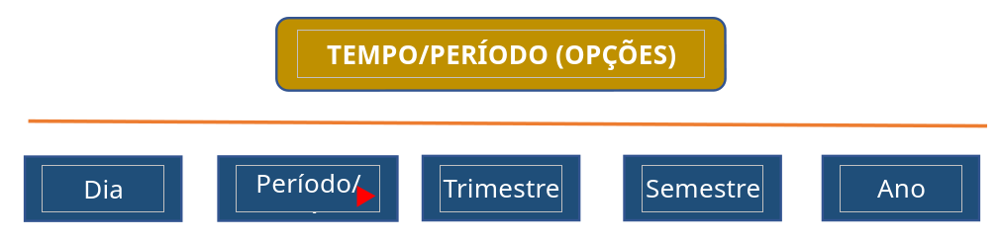
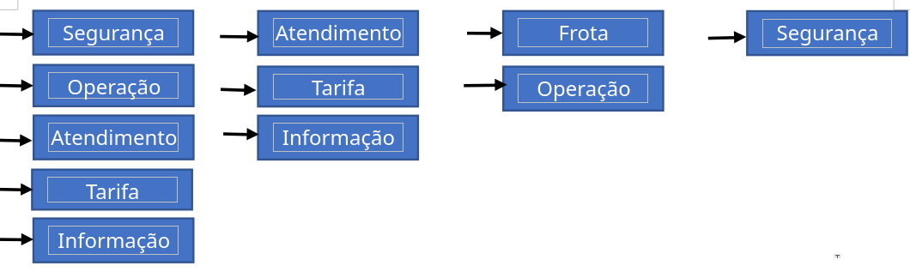
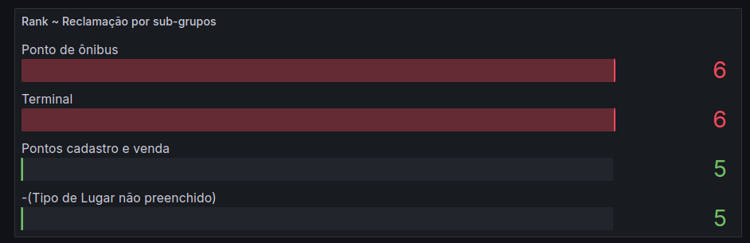
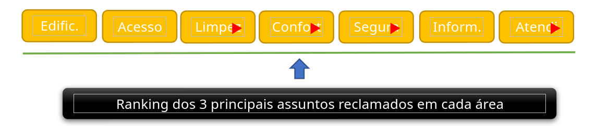

# Dashboards Grafana - Monitoramento de Interações

Este repositório documenta a criação e configuração de múltiplos dashboards no Grafana para análise de interações organizacionais, segmentadas por temas como operação da frota, infraestrutura, denúncias, entre outros. Os dados são obtidos de um banco de dados PostgreSQL.

## 🔗 Documentação Oficial

- [Datasource PostgreSQL no Grafana](https://grafana.com/docs/grafana/latest/datasources/postgres/)

## 📅 Intervalos de Data

Os dashboards utilizam `Quick Ranges` do Grafana com variáveis de tempo `__timeFrom()` e `__timeTo()` para filtrar dados por período.

- Obter a data via Search **Quick Ranges**

  - **link: https://grafana.com/docs/grafana/latest/datasources/postgres/**
  - **Criando variável Dropdown** - 
    - 
    - ```sql
      -- Lembrando que para a opção all deve utilizar query em seu conteúdo
      SELECT title FROM responsible
      ORDER BY title
      ```

  ***

  ### 0). **DASHBOARD** _Gráfico inicial – apresentação inicial da interação por tipo_

  - 
  - [DASHBOARD 0 ~ GRÁFICO INICIAL-1716818437986.json](./assets/DASHBOARD_0_~_GRÁFICO_INICIAL-1716818437986_1716818440612_0.json)
  - **Iniciando:**

    - ```sql
      SELECT
        event_date :: DATE,
        it.description,
        count(event_date :: DATE) AS sum_date
      FROM
        interaction
        JOIN
          interaction_type it on it.id = interaction.interaction_type

      WHERE
      	interaction.event_date BETWEEN  $__timeFrom() AND 	$__timeTo()
      GROUP BY
        event_date:: DATE,
        it.description
      ORDER BY
      	event_date ASC
      ```

    - **Filtros:** _Classificação ~ Por Responsável, Grupo, Consorcio e Linha de Ônibus_
      - 
      - 
      - ```sql
        SELECT
          count(interaction.id) AS sum_type,
          COALESCE("group".title, '-(Grupo não preenchido)') AS _group
        FROM
          interaction
          JOIN interaction_type it on it.id = interaction.interaction_type
          JOIN "group" ON "group".id = it."group"
        WHERE
          interaction.event_date BETWEEN $__timeFrom()
          AND $__timeTo()
        GROUP BY
          "group".title
        ORDER BY
          sum_type DESC
        ```
    - **Filtros** _Por Responsável, Grupo, Subgrupo, Consorcio e Linha de Ônibus_
      - 
      - 
        - ```sql
          SELECT
            count(interaction.id) AS sum_type,
            COALESCE("group".title, 'Sem Grupo') AS _group,
            COALESCE(subgroup.title, 'Sem Subgrupo') AS _subgroup,
            COALESCE(responsible.title, 'Sem Responsável') AS _responsible,
            COALESCE(consortium.title, 'Sem Consórcio') AS _consortium,
            COALESCE(busline_responsible.title, 'Sem Linha') AS _busline_responsible
          FROM
            interaction
            JOIN interaction_type it ON it.id = interaction.interaction_type
            JOIN "group" ON "group".id = it."group"
            JOIN subgroup ON subgroup.id = it.subgroup
            LEFT JOIN responsible ON responsible.id = interaction.responsible
            LEFT JOIN consortium ON consortium.id = responsible.consortium
            LEFT JOIN busline_responsible ON busline_responsible.id = interaction.busline_responsible
          WHERE
            (
              COALESCE(responsible.title, 'Sem Responsável') IN ($responsible)
              AND COALESCE("group".title, 'Sem Grupo') IN ($group)
              AND COALESCE(subgroup.title, 'Sem Subgrupo') IN ($subgroup)
              AND COALESCE(consortium.title, 'Sem Consórcio') IN ($consortium)
              AND COALESCE(busline_responsible.title, 'Sem Linha') IN ($busline_responsible)
            )
            AND (
              interaction.event_date BETWEEN $__timeFrom()
              AND $__timeTo()
            )
          GROUP BY
            "group".title,
            responsible.title,
            consortium.title,
            busline_responsible.title,
            subgroup.title
          ORDER BY
            sum_type DESC;
          ```
        - 
          - [DASHBOARD 0 ~ GRÁFICO INICIAL-1716581943184.json](./assets/DASHBOARD_0_~_GRÁFICO_INICIAL-1716581943184_1716581958655_0.json)

  ***

  ### 1) **DASHBOARD** _OPERAÇÃO DA FROTA_

  - 
  - [DASHBOARD 1 ~ OPERAÇÃO DA FROTA-1716818481132.json](./assets/DASHBOARD_1_~_OPERAÇÃO_DA_FROTA-1716818481132_1716818490562_0.json)
  - Iniciando:

    - **Filtros** _Por Responsável, Grupo e Linha de Ônibus_

      - 
      - 
      - {:height 223, :width 718}
      - 
      -
      - ```sql
        SELECT
          count(interaction.id) AS sum_type,
          COALESCE("group".title,'-(Grupo não preenchido)') AS _group,
          COALESCE(responsible.title, '-(Responsável não preenchido)') AS _responsible,
          COALESCE(busline_responsible.title, '-(Linha de ônibus não preenchida)') AS _busline_responsible,
          COALESCE(involved_type.title, '-(Envolvido não preenchido)') AS _involved_type

        FROM
          interaction
          JOIN interaction_type it ON it.id = interaction.interaction_type
          JOIN "group" ON "group".id = it."group"

          LEFT JOIN responsible ON responsible.id = interaction.responsible
          LEFT JOIN consortium ON consortium.id = responsible.consortium
          LEFT JOIN busline_responsible ON busline_responsible.id = interaction.busline_responsible

          LEFT JOIN interaction_type_involved_type  ON interaction_type_involved_type.interaction_type = it.id
          LEFT JOIN involved_type on involved_type.id = interaction_type_involved_type.involved_type

        WHERE
          (
            (responsible.title IN ($responsible) OR responsible.title IS NULL)
            AND ("group".title IN ($group) OR "group".title IS NULL)
            AND (busline_responsible.title IN ($busline_responsible) OR busline_responsible.title IS NULL)
            AND (involved_type.title IN ($involved_type) OR involved_type.title IS NULL)

          )
          AND (
            interaction.event_date BETWEEN $__timeFrom() AND $__timeTo()
          )
        GROUP BY
          "group".title,
          responsible.title,
          busline_responsible.title,
          involved_type.title
        ORDER BY
          sum_type DESC;

        ```

    - **Filtros** **Ranking das 2 reclamações de maior incidência**

      - 
      - 
      - 
      - ```sql
        SELECT
          count(it.id) AS sum_type,
            COALESCE(involved_type.title, 'Sem Envolvido') AS _involved_type,
          COALESCE(area.title, 'Sem Área') AS _area,

          COALESCE(subgroup.title, 'Sem Subgrupo') AS _subgroup,
          COALESCE(subject.title, 'Sem Assunto') AS _subject
        FROM
          interaction
          JOIN interaction_type it on it.id = interaction.interaction_type
          JOIN "group" ON "group".id = it."group"
          JOIN subgroup ON subgroup.id = it.subgroup
          JOIN subject ON subject.id = interaction.subject
          JOIN area ON area.id = subject.area
          LEFT JOIN interaction_type_involved_type ON interaction_type_involved_type.interaction_type = it.id
          LEFT JOIN involved_type on involved_type.id = interaction_type_involved_type.involved_type
        WHERE
          (
            ("group".title = 'Reclamação')
            AND COALESCE(subgroup.title, 'Sem Subgrupo') IN ($subgroup)
            AND COALESCE(subject.title, 'Sem Assunto') IN ($subject)
            AND COALESCE(area.title, 'Sem Área') IN ($area)
            AND COALESCE(involved_type.title, 'Sem Envolvido') IN ($involved_type)
          )
          AND(
            interaction.event_date BETWEEN $__timeFrom()
            AND $__timeTo()
          )
        GROUP BY
          subject.title,
          area.title,
          subgroup.title,
          involved_type.title
        ORDER BY
          sum_type DESC
        LIMIT
          2
        ```

      - [DASHBOARD 1 ~ OPERAÇÃO DA FROTA-1716583424786.json](./assets/DASHBOARD_1_~_OPERAÇÃO_DA_FROTA-1716583424786_1716583436419_0.json)

  ***

  ### 2) **DASHBOARD** _INFRAESTRUTURA_

  - 
  - [DASHBOARD 2 ~ INFRAESTRUTURA-1716818606212.json](./assets/DASHBOARD_2_~_INFRAESTRUTURA-1716818606212_1716818617838_0.json)
  - Iniciando:

    - Filtros: Grupo e Área
      - 
      - {:height 394, :width 687}
      - 
      - ```sql
        SELECT
          count(it.id) AS sum_type,
          COALESCE("group".title, 'Sem Grupo') AS _group,
          COALESCE(area.title, 'Sem Área') AS _area,
          COALESCE(subject.title, 'Sem Assunto') AS _subject
        FROM
          interaction
          JOIN interaction_type it on it.id = interaction.interaction_type
          JOIN "group" ON "group".id = it."group"
          JOIN subgroup ON subgroup.id = it.subgroup
          JOIN subject ON subject.id = interaction.subject
          JOIN area ON area.id = subject.area
        WHERE
          (
             COALESCE("group".title, 'Sem Grupo') IN ($group)
            AND COALESCE(subject.title, 'Sem Assunto') IN ($subject)
            AND COALESCE(subgroup.title, 'Sem Subgrupo') IN ($subgroup)
            AND COALESCE(area.title, 'Sem Área') IN ($area)
          )
          and(
            interaction.event_date BETWEEN $__timeFrom()
            AND $__timeTo()
          )
        GROUP BY
          "group".title,
          subject.title,
          area.title
        ORDER BY
          sum_type DESC
        ```
    - Filtros:

      - 
      - 
      - 
      - ```sql
        SELECT
          count(it.id) AS sum_type,
          COALESCE(subgroup.title,'Sem Subgrupo') as _subgroup
        FROM
          interaction
          JOIN interaction_type it on it.id = interaction.interaction_type
          JOIN "group" ON "group".id = it."group"
          JOIN subgroup ON subgroup.id = it.subgroup
          LEFT JOIN interaction_type_place_type itpt on itpt.interaction_type = it.id
          LEFT JOIN place_type ON place_type.id = itpt.place_type

        WHERE
          (
            "group".title = 'Reclamação'
             AND COALESCE(subgroup.title, 'Sem Subgrupo') IN ($subgroup)


          )
          and(
            interaction.event_date BETWEEN $__timeFrom()
            AND $__timeTo()
          )
        GROUP BY
          subgroup.title
          ORDER BY
          sum_type DESC
        ```

    - Filtros:
      - 
      - 
      - 
      - ```sql
        SELECT
          count(it.id) AS sum_type,
          COALESCE(place_type.title, 'Sem Lugar') as _place_type
        FROM
          interaction
          JOIN interaction_type it on it.id = interaction.interaction_type
          JOIN "group" ON "group".id = it."group"
          JOIN subgroup ON subgroup.id = it.subgroup
          LEFT JOIN interaction_type_place_type itpt on itpt.interaction_type = it.id
          LEFT JOIN place_type ON place_type.id = itpt.place_type
        WHERE
          (
            "group".title = 'Reclamação'
            AND COALESCE(subgroup.title, 'Sem Subgrupo') IN ($subgroup)
          )
          and(
            interaction.event_date BETWEEN $__timeFrom()
            AND $__timeTo()
          )
        GROUP BY
          place_type.title
        ORDER BY
          sum_type DESC
        ```
    - FIltros:

      - {:height 96, :width 294}
      - 
      - 
      - ```sql
        SELECT
          count(it.id) AS sum_type,
          COALESCE(area.title, 'Sem Área') AS _area
        FROM
          interaction
          JOIN interaction_type it on it.id = interaction.interaction_type
          JOIN "group" ON "group".id = it."group"
           JOIN subject ON subject.id = interaction.subject
           JOIN area ON area.id = subject.area
        WHERE
          (
            "group".title = 'Reclamação'

          )
          and(
            interaction.event_date BETWEEN $__timeFrom()
            AND $__timeTo()
          )
        GROUP BY
          area.title
        ORDER BY
          sum_type DESC
        ```

    - FIltros:

      - {:height 96, :width 294}
      - 
      - 
      - ```sql
        SELECT
          count(it.id) AS sum_type,
          COALESCE(subject.title, 'Sem Assunto') AS _subject
        FROM
          interaction
          JOIN interaction_type it on it.id = interaction.interaction_type
          JOIN "group" ON "group".id = it."group"
          JOIN subgroup ON subgroup.id = it.subgroup
          JOIN subject ON subject.id = interaction.subject
          JOIN area ON area.id = subject.area
        WHERE
          ("group".title = 'Reclamação')
          AND COALESCE(area.title, 'Sem Área') IN ($area)
          and(
            interaction.event_date BETWEEN $__timeFrom()
            AND $__timeTo()
          )
        GROUP BY
          subject.title
        ORDER BY
          sum_type DESC

        ```

      - [DASHBOARD 2 ~ INFRAESTRUTURA-1716814097890.json](./assets/DASHBOARD_2_~_INFRAESTRUTURA-1716814097890_1716814109903_0.json)

  ***

  ### 3) **DASHBOARD** _SISTEMAS DE T.I. E CALL CENTER_

  - 
  - [DASHBOARD 3 ~ SISTEMAS DE T.I. E CALL CENTER-1716818661916.json](./assets/DASHBOARD_3_~_SISTEMAS_DE_T.I._E_CALL_CENTER-1716818661916_1716818671597_0.json)
  - Iniciando:

    - FIltros:
      - 
      - 
      - 
      - ```sql
        SELECT
          count(it.id) AS sum_type,
          "group".title as _group,
          subgroup.title as _subgroup
        FROM
          interaction
          JOIN interaction_type it on it.id = interaction.interaction_type
          JOIN "group" ON "group".id = it."group"
          JOIN subgroup ON subgroup.id = it.subgroup
        WHERE
          (
            "group".title IN ($group)
            AND subgroup.title IN ($subgroup)
          )
          and(
            interaction.event_date BETWEEN $__timeFrom()
            AND $__timeTo()
          )
        GROUP BY
          "group".title,
          subgroup.title
        ORDER BY
          sum_type DESC
        ```
    - Filtros:
      - {:height 96, :width 294}
      - 
      - 
      - ```sql
        SELECT
          count(it.id) AS sum_type,
          subgroup.title as _subgroup
        FROM
          interaction
          JOIN interaction_type it on it.id = interaction.interaction_type
          JOIN "group" ON "group".id = it."group"
          JOIN subgroup ON subgroup.id = it.subgroup
        WHERE
          (
            "group".title = 'Reclamação'
            AND (subgroup.title IN ($subgroup))
          )
          and(
            interaction.event_date BETWEEN $__timeFrom()
            AND $__timeTo()
          )
        GROUP BY
          subgroup.title
        ORDER BY
          sum_type DESC
        ```
    - Filtros:
      - {:height 96, :width 294}
      - 
      - 
      - ```sql
        SELECT
          count(it.id) AS sum_type,
          area.title as _area
        FROM
          interaction
          JOIN interaction_type it on it.id = interaction.interaction_type
          JOIN "group" ON "group".id = it."group"
          JOIN subgroup ON subgroup.id = it.subgroup
          JOIN subject ON subject.id = interaction.subject
          JOIN area ON area.id = subject.area
        WHERE
          (
            "group".title = 'Reclamação'
            AND (subgroup.title IN ($subgroup))
          )
          and(
            interaction.event_date BETWEEN $__timeFrom()
            AND $__timeTo()
          )
        GROUP BY
          area.title
        ORDER BY
          sum_type DESC
        ```
    - FIltros:
    - {:height 96, :width 294}
    - 
    - 
    - ```sql
      SELECT
        count(it.id) AS sum_type,
       subject.title AS _subject
      FROM
        interaction
        JOIN interaction_type it on it.id = interaction.interaction_type
        JOIN "group" ON "group".id = it."group"
        JOIN subgroup ON subgroup.id = it.subgroup
        JOIN subject ON subject.id = interaction.subject
        JOIN area ON area.id = subject.area
      WHERE
        (
          "group".title = 'Reclamação'
          AND
            subgroup.title IN ($subgroup)

        )
        and(
          interaction.event_date BETWEEN $__timeFrom()
          AND $__timeTo()
        )
      GROUP BY
        subject.title
      ORDER BY
        sum_type DESC
      ```

    - [DASHBOARD 3 ~ SISTEMAS DE T.I. E CALL CENTER-1716815073085.json](./assets/DASHBOARD_3_~_SISTEMAS_DE_T.I._E_CALL_CENTER-1716815073085_1716815083638_0.json)

  - ***

  ### 4) _DASHBOARD_ _ PODER PÚBLICO_

  - 
  - [DASHBOARD 4 ~ PODER PÚBLICO-1716818747932.json](./assets/DASHBOARD_4_~_PODER_PÚBLICO-1716818747932_1716818757236_0.json)
  - Iniciando:
    - FIltros:
      - 
      - 
      - 
      - 
      - ```sql
        SELECT
          count(it.id) AS sum_type,
          COALESCE("group".title, 'Sem Grupo') AS _group,
          COALESCE(subgroup.title, 'Sem Subgrupo') AS _subgroup,
          COALESCE(area.title, 'Sem Área') AS _area
        FROM
          interaction
          JOIN interaction_type it on it.id = interaction.interaction_type
          JOIN "group" ON "group".id = it."group"
          JOIN subgroup ON subgroup.id = it.subgroup
          JOIN subject ON subject.id = interaction.subject
          JOIN area ON area.id = subject.area
          LEFT JOIN interaction_type_involved_type ON interaction_type_involved_type.interaction_type = it.id
          LEFT JOIN involved_type on involved_type.id = interaction_type_involved_type.involved_type
        WHERE
          (
            COALESCE("group".title, 'Sem Grupo') IN ($group)
            AND COALESCE(subgroup.title, 'Sem Subgrupo') IN ($subgroup)
            AND COALESCE(area.title, 'Sem Área') IN ($area)
          )
          AND(
            interaction.event_date BETWEEN $__timeFrom()
            AND $__timeTo()
          )
        GROUP BY
          "group".title,
          subgroup.title,
          area.title
        ORDER BY
          sum_type DESC
        ```
      - [DASHBOARD 4 ~ PODER PÚBLICO-1716476935345.json](./assets/DASHBOARD_4_~_PODER_PÚBLICO-1716476935345_1716476949888_0.json)
      -

  ***

  ### 5) _DASHBOARD_ \* _DENÚNCIAS_

  - 
  - [DASHBOARD 5~ DENÚNCIA-1716818381161.json](./assets/DASHBOARD_5~_DENÚNCIA-1716818381161_1716818401690_0.json)
  - Iniciando:

    - Filtos:

      - 
      - 
      - ```sql
        SELECT
          count(interaction.id) AS sum_type,
          COALESCE("group".title,'-(Grupo não preenchido)') AS _group,
          COALESCE(subgroup.title,'-(subgrupo)') as _subgroup
        FROM
          interaction
          JOIN interaction_type it ON it.id = interaction.interaction_type
          JOIN "group" ON "group".id = it."group"
          JOIN subgroup ON subgroup.id = it.subgroup
        WHERE
          (
             "group".title = 'Denúncia'
            AND (subgroup.title IN ($subgroup) OR subgroup.title IS NULL)
          )
          AND (
            interaction.event_date BETWEEN $__timeFrom() AND $__timeTo()
          )
        GROUP BY
          "group".title,
          subgroup.title
        ORDER BY
          sum_type DESC;

        ```

    - Filtos:
      - 
      - ```sql
        SELECT
          count(interaction.id) AS sum_type,
          COALESCE(
            responsible.title,
            '-(Responsável não preenchido)'
          ) AS _responsible
        FROM
          interaction
          JOIN interaction_type it ON it.id = interaction.interaction_type
          LEFT JOIN responsible ON responsible.id = interaction.responsible
          JOIN "group" ON "group".id = it."group"
          JOIN subgroup ON subgroup.id = it.subgroup
        WHERE
          (
            "group".title = 'Denúncia'
            AND (
              responsible.title IN ($responsible)
              OR responsible.title IS NULL
            )
            AND(
              subgroup.title IN ($subgroup)
              OR subgroup.title IS NULL
            )
          )
          AND (
            interaction.event_date BETWEEN $__timeFrom()
            AND $__timeTo()
          )
        GROUP BY
          responsible.title
        ORDER BY
          sum_type DESC;
        ```
    - FIltros:
      - 
      - 
      - ```sql
        SELECT
          count(interaction.id) AS sum_type,
          COALESCE(place_type.title, '-(Lugar não preenchido)') as _place_type
        FROM
          interaction
          JOIN interaction_type it ON it.id = interaction.interaction_type
          JOIN "group" ON "group".id = it."group"
          JOIN subgroup ON subgroup.id = it.subgroup
          LEFT JOIN interaction_type_place_type itpt on itpt.interaction_type = it.id
          LEFT JOIN place_type ON place_type.id = itpt.place_type
        WHERE
          (
            "group".title = 'Denúncia'
            AND (
              subgroup.title IN ($subgroup)
              OR subgroup.title IS NULL
            )
          )
          AND (
            interaction.event_date BETWEEN $__timeFrom()
            AND $__timeTo()
          )
        GROUP BY
          place_type.title
        ORDER BY
          sum_type DESC;
        ```
    - FIltros:
      - 
      - 
      - ```sql
        SELECT
          count(interaction.id) AS sum_type,
          COALESCE(
            responsible.title,
            '-(Responsável não preenchido)'
          ) AS _responsible
        FROM
          interaction
          JOIN interaction_type it ON it.id = interaction.interaction_type
          LEFT JOIN responsible ON responsible.id = interaction.responsible
          JOIN "group" ON "group".id = it."group"
          JOIN subgroup ON subgroup.id = it.subgroup
             LEFT JOIN interaction_type_place_type itpt on itpt.interaction_type = it.id
          LEFT JOIN place_type ON place_type.id = itpt.place_type
        WHERE
          (
            "group".title = 'Denúncia'
            AND (
              responsible.title IN ($responsible)
              OR responsible.title IS NULL
            )
            AND(
              subgroup.title IN ($subgroup)
              OR subgroup.title IS NULL
            )
          )
          AND (
            interaction.event_date BETWEEN $__timeFrom()
            AND $__timeTo()
          )
        GROUP BY
          responsible.title
        ORDER BY
          sum_type DESC;
        ```
    - Filtros:
      - 
      - 
      - ```sql
        SELECT
          count(interaction.id) AS sum_type,
          COALESCE(place_type.title, '-(Lugar não preenchido)') as _place_type
        FROM
          interaction
          JOIN interaction_type it ON it.id = interaction.interaction_type
          JOIN "group" ON "group".id = it."group"
          JOIN subgroup ON subgroup.id = it.subgroup
          LEFT JOIN interaction_type_place_type itpt on itpt.interaction_type = it.id
          LEFT JOIN place_type ON place_type.id = itpt.place_type
        WHERE
          (
            "group".title = 'Denúncia'
            AND (
              subgroup.title IN ($subgroup)
              OR subgroup.title IS NULL
            )
          )
          AND (
            interaction.event_date BETWEEN $__timeFrom()
            AND $__timeTo()
          )
        GROUP BY
          place_type.title
        ORDER BY
          sum_type DESC
          LIMIT 3
        ```
