# 🚀 Guia de Inicialização — Projeto Geofrota

Este guia contém os passos essenciais para clonar o repositório, restaurar o banco de dados, executar o ambiente com Docker, iniciar o Directus e realizar migrações de dados.

---

## 🔁 Clonar Repositório

Clone o repositório oficial:

```bash
git clone git@gitlab.com:geocontrol-dev/geofrota/geofrota.git
```

## Docker

### 📦 Restaurar o Dump do Banco

- Baixe o arquivo do dump:

```bash
geortk.20241011_155317.dump.bz2
```

- Execute o script de restauração:

```bash
./tools/db/restore-dump-docker-db.sh ~/Downloads/geortk.20241011_155317.dump.bz2
```

### ▶️ Subir o ambiente com Docker Compose

```bash
./tools/db/restore-dump-docker-db.sh ~/Downloads/geortk.20241011_155317.dump.bz2
```

## 🧩 Directus

### 🚀 Iniciar o servidor

```bash
pnpm start
```

### 🛠️ Build com watch

```bash
pnpm run build:watch
```

### 🛠️ Build com watch

```bash
pnpm run build:watch
```

### 🧹 Clean com watch

```bash
pnpm run clean:watch
```

### 🗄️ Criar banco novo

```bash
pnpm bootstrap
```

## 🧬 Migração de Dados

```bash
pnpm gen-config-migration-data
```

## ⚙️ Knex

### Up e Down

```js
      import { Knex } from "knex";
      import {
        downgradeMigrationData,
        upgradeMigrationData,
      } from "./utils/migration.js";
      import { DiffConfigsMigrationDataJson } from "./utils/tools/config-diff.js";

      export async function up(knex: Knex) {
        await knex.transaction(async (tx) => {
          await upgradeMigrationData(tx, migrationData);
        });
      }

      export async function down(knex: Knex) {
        await knex.transaction(async (tx) => {
          await downgradeMigrationData(tx, migrationData);
        });
      }

      const migrationData = {....json copiado}
```

### Criar tabelas

```js
import { Knex } from "knex";

export async function up(knex: Knex) {
  await knex.transaction(async (tx) => {
    const hasClienteTable = await tx.schema.hasTable("cliente");
    console.log({ hasClienteTable });
    if (!hasClienteTable) {
      await tx.schema.createTable("cliente", (builder) => {
        builder
          .increments("id", { primaryKey: true })
          .notNullable()
          .primary({ constraintName: "cliente_pkey" })
          .index("ix_cliente_id"); //TODO: Dúvida -> no banco ele deu o nome da sequencia como "cliente_id_seq", e utilizando o increments o nome

        // builder.string("nome").notNullable().unique();
        builder.string("nome").nullable().index("ix_cliente_nome");
        builder
          .string("cnpj")
          .nullable()
          .unique({ indexName: "cliente_cnpj_unique" });
        builder
          .string("email")
          .nullable()
          .unique({ indexName: "cliente_email_unique" });
        // builder.timestamp('created_at', {useTz: true}).notNullable().defaultTo('CURRENT_TIMESTAMP');
        builder.timestamp("created_at", { useTz: false }).nullable();
        builder.timestamp("updated_at", { useTz: false }).nullable();

        //criando as contrains duplicadas
        builder.unique(["cnpj"], {
          indexName: "cliente_cnpj_key",
          useConstraint: true,
        });
        builder.unique(["email"], {
          indexName: "cliente_email_key",
          useConstraint: true,
        });
      });
    }
  });
}

export async function down(knex: Knex) {
  await knex.transaction(async (tx) => {
    //fazer o drop table com apenas os nomes da tabela..
    //TODO
    await tx.schema.dropTable("cliente");
  });
}
```

---

## Criar Banco

### via código sql

```sql
    DROP DATABASE IF EXISTS geortk_empty with (force);

    CREATE DATABASE geortk_empty
        WITH
        OWNER = postgres
        TEMPLATE = template_postgis
        ENCODING = 'UTF8'
        LOCALE_PROVIDER = 'libc'
        CONNECTION LIMIT = -1
        IS_TEMPLATE = False;
```

### via imagem

    - 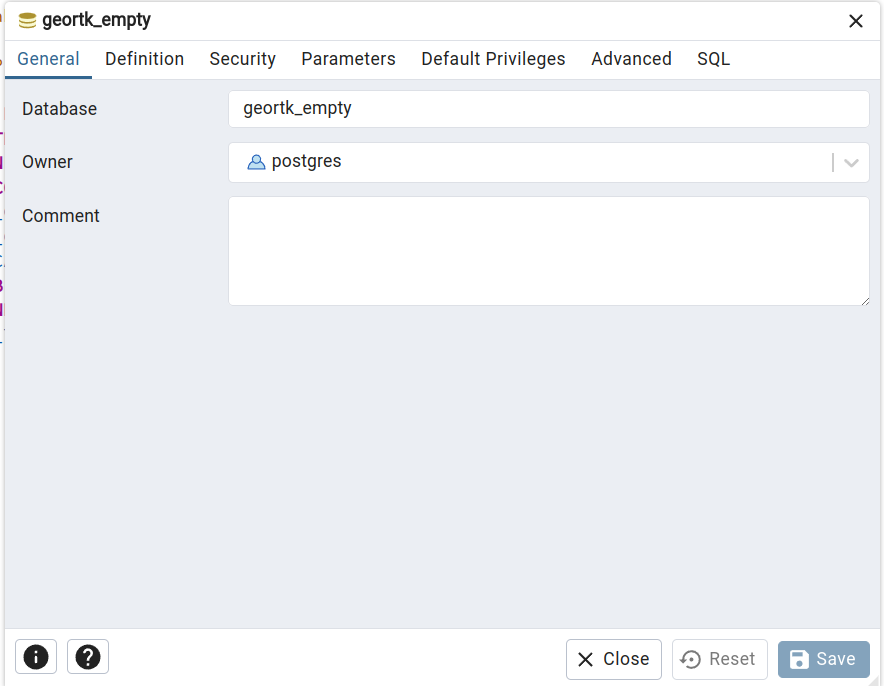
    - 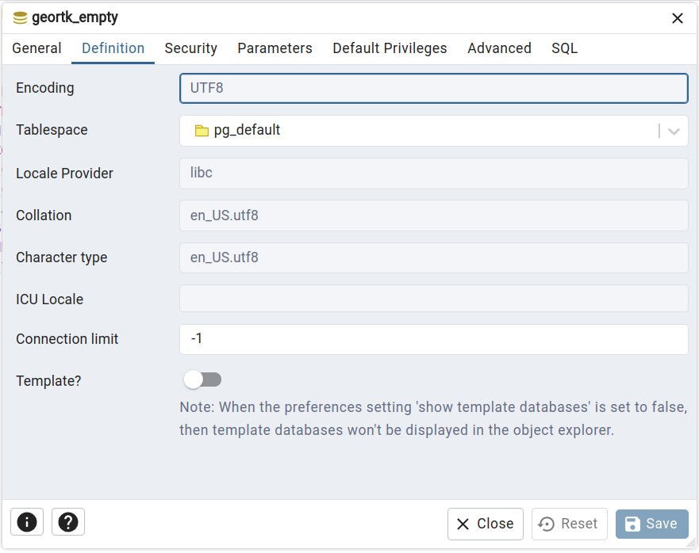
    - 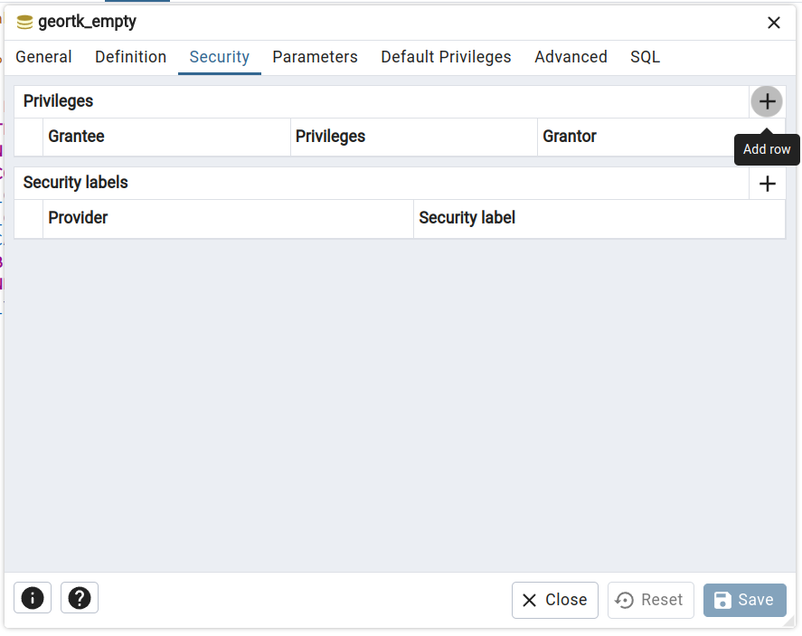

### Comandos:

    - bootstrap

## Modificações no geofrota (tabelas)

- MODIFICAÇÕES ~estou refatorando o codigo e retirando coisas desnecessárias e conceitualmente erradas:
  - [FINALIZADO] CLIENTE:
    - 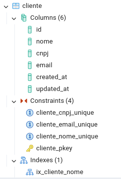
    - id
      - Não pode ser nulo
      - Já tenho a chave primária (que é como índice para o id), logo não preciso criar um índice em cima do id **_A indicação da chave primária automaticamente cria um índice para ela. Não é necessário fazer mais nada._**
        - Fonte: https://pt.stackoverflow.com/questions/147006/%C3%8Dndices-em-colunas-de-chave-prim%C3%A1ria
    - nome
      - **deve ser único?** sim.
      - **pode ser nulo?** não, essa informação é necessária ao cadastrar um novo cliente.
    - cnpj
      - **deve ser único?** sim.
      - **pode ser nulo?** não, essa informação é necessária ao cadastrar um novo cliente.
      - Remoção de Constantes/index duplicados
      - tamanho pré definido, visto que são **_14 (quatorze) caracteres numéricos para o caso de CNPJ_**
    - email
      - **deve ser único?** sim.
      - **pode ser nulo?** não, essa informação é necessária ao cadastrar um novo cliente.
    - created_at
      - **deve ser único?** sim, não foram encontrados registros repetidos no banco.
      - **deve ter time zone?** sim, Adicionar Time Zone
      - **valor default?** sim, default para _CURRENT_TIMESTAMP_
      - **deve ser nulo?** não, essa informação é necessária ao criar um novo cliente.
    - updated_at
      - **deve ser único?** sim, não foram encontrados registros repetidos no banco.
      - **deve ter time zone?** sim, Adicionar Time Zone
      - **valor default?** sim, default para _CURRENT_TIMESTAMP_
      - **deve ser nulo?** não, essa informação é necessária ao atualizar um novo cliente.
    -
    - IMAGENS:
      - ANTES de modificar:
        - 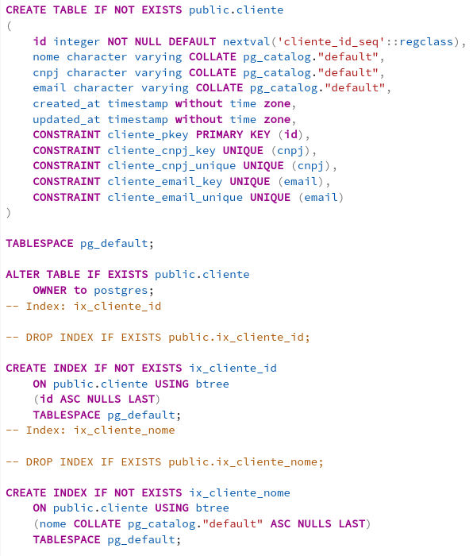
      - UP
        - 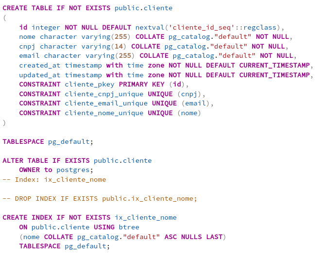
      - DOWN
        - 
  - [FINALIZADO] USUÁRIO:
    collapsed:: true
    - 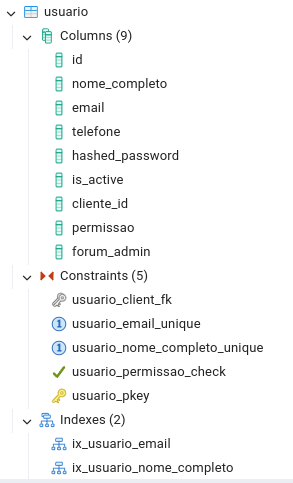
    - id
      - Já tenho a chave primária (que é como índice para o id), logo não preciso criar um índice em cima do id **_A indicação da chave primária automaticamente cria um índice para ela. Não é necessário fazer mais nada._**
        - Fonte: https://pt.stackoverflow.com/questions/147006/%C3%8Dndices-em-colunas-de-chave-prim%C3%A1ria
    - nome_completo
      - **deve ser único?** sim.
      - **pode ser nulo?** não, essa informação é necessária ao cadastrar um novo usuário.
    - email
      - **deve ser único?** sim.
      - **pode ser nulo?** não, essa informação é necessária ao cadastrar um novo usuário.
    - telefone
      - **pode ser nulo?** sim, é uma informação opcional.
      - **deve ser único?** não, se trata de um campo opcional, ou seja, na tabela pode ser encontrado vários campos nulos
    - hashed_password
      - **pode ser nulo?** sim.
      - **deve ser nulo?** não, diferentes usuários podem possuir a mesma senha.
    - is_active
      - **deve ser único?** não, se trata de um campo booleano.
      - **deve ser nulo?** não, se trata de um campo booleano.
      - **deve ter valor default?** sim, true pois o usuário deve ser ativado no momento em que é criado.
    - cliente_id
      - **deve ser único?** não, o mesmo usuário pode ter mais de um cliente.
      - **deve ser nulo?** não, ele faz parte da chave estrangeira para a tabela de cliente.
        - ```sql
          CONSTRAINT usuario_client_fk FOREIGN KEY (cliente_id)
          ```
    - permissao
      - **deve ser único?** não, se trata de um campo enum.
      - **deve ser nulo?** não, se trata de um campo enum
      - **deve ter valor default?** sim, padrao pois deve ser atribuido ao usuário qual permissão ele irá ter no momento de sua criação
    - forum_admin
      - **deve ser único?** não, se trata de um campo booleano.
      - **pode ser nulo?** não, se trata de um campo booleano.
      - **deve ter valor default?** sim, false pois nem todo usuário é admin.
      - alteração na chave estrangeira em caso de deletar o usuário ".onDelete("SET NULL");"
    - IMAGENS:
      - Antes:
        - 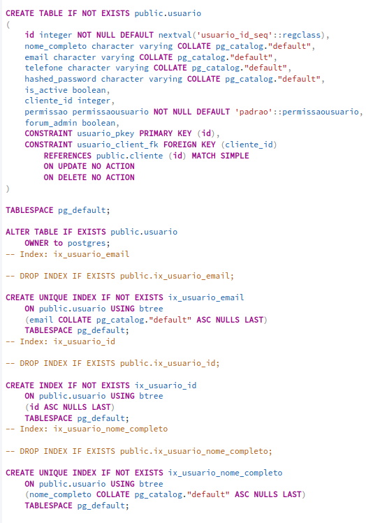
      - Up:
        - 
      - Down:
        - 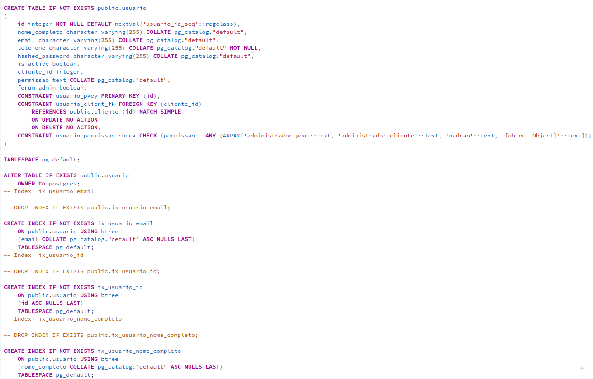
  - [FINALIZADO] EQUIPAMENTOS:
    collapsed:: true
    - 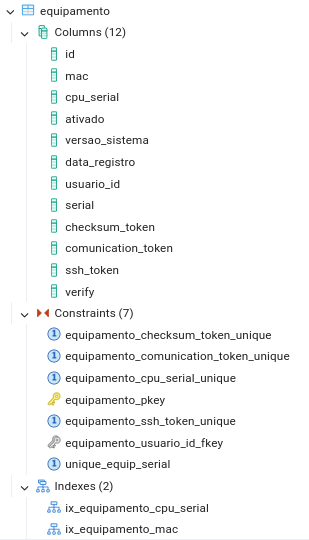
    - id
      - Já tenho a chave primária (que é como índice para o id), logo não preciso criar um índice em cima do id **_A indicação da chave primária automaticamente cria um índice para ela. Não é necessário fazer mais nada._**
        - Fonte: https://pt.stackoverflow.com/questions/147006/%C3%8Dndices-em-colunas-de-chave-prim%C3%A1ria
        -
    - mac
      - **deve ser único?** não, foram encontrados registros repetidos no banco.
        - ```sql SELECT mac, COUNT(*) AS total
          FROM public.equipamento
          GROUP BY mac
          HAVING COUNT(*) > 1
          ORDER BY total DESC;
          ```
        - 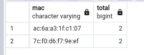
      - **deve ser nulo?** não, essa informação é necessária ao cadastrar um novo equipamento.
    - cpu_serial
      - **deve ser único?** sim, é uma sequência única de números e/ou letras que são usados para identificar seu equipamento.
      - **deve ser nulo?** não, essa informação é necessária ao cadastrar um novo equipamento.
    - ativado
      - **deve ser único?** não, se trata de um campo booleano.
      - **pode ser nulo?** não, se trata de um campo booleano.
      - **deve ter valor default?** sim, true.
    - versao_sistema
      - **deve ser único?** não, da versão do sistema dos equipamentos, vários equipamentos podem apresentar a mesma versão
      - **pode ser nulo?** não, essa informação é necessária ao cadastrar um novo equipamento.
    - data_registro
      - **deve ser único?** sim, não foram encontrados registros repetidos no banco.
      - **deve ter time zone?** sim, Adicionar Time Zone
      - **valor default?** sim, default para _CURRENT_TIMESTAMP_
      - **deve ser nulo?** não, essa informação é necessária ao cadastrar um novo equipamento.
    - usuario_id
      - **deve ser único?** não, o mesmo usuário pode ter mais de um equipamento.
      - **deve ser nulo?** não, ele faz parte da chave estrangeira para a tabela de usuários.
        - ```sql
          CONSTRAINT equipamento_usuario_id_fkey FOREIGN KEY (usuario_id)
          ```
    - serial
      - **deve ser único?** sim, cada equipamento possui deve possuir um numero de série específico.
      - **deve ser nulo?** não, essa informação é necessária ao cadastrar um novo equipamento.
    - checksum_token
      - **deve ser único?** sim, se trata de um campo de token
      - **deve ser nulo?** não, essa informação é necessária ao cadastrar um novo equipamento.
    - comunication_token
      - **deve ser único?** sim, se trata de um campo de token
      - **deve ser nulo?** não, essa informação é necessária ao cadastrar um novo equipamento.
    - ssh_token
      - **deve ser único?** sim, se trata de um campo de token
      - **deve ser nulo?** não, essa informação é necessária ao cadastrar um novo equipamento.
    - verify boolean
      - **deve ser único?** não, se trata de um campo booleano.
      - **deve ser nulo?** não, se trata de um campo booleano.
      - **deve ter valor default?** sim, false. (dúvida aqui?) **_colocarei TRUE_**
    - IMAGEM:
      - Antes:
        - 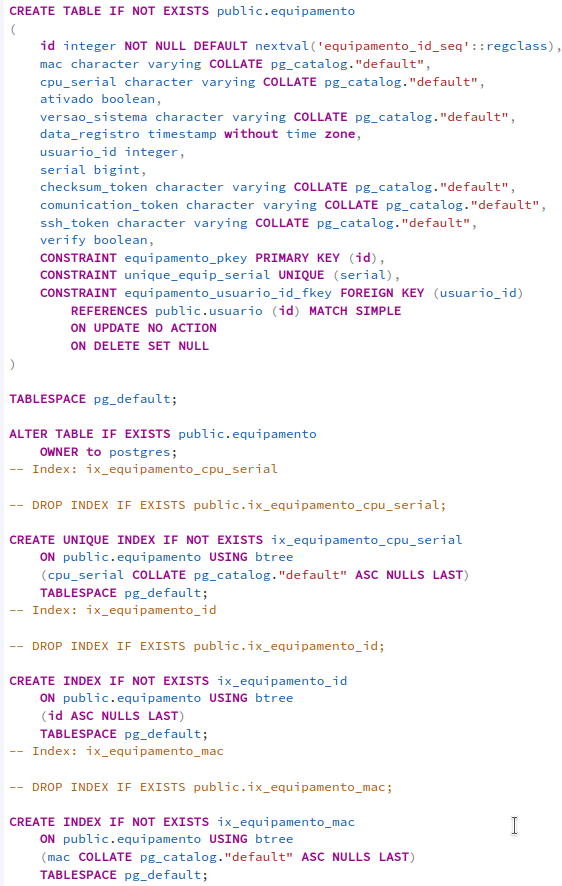
      - Up:
        - 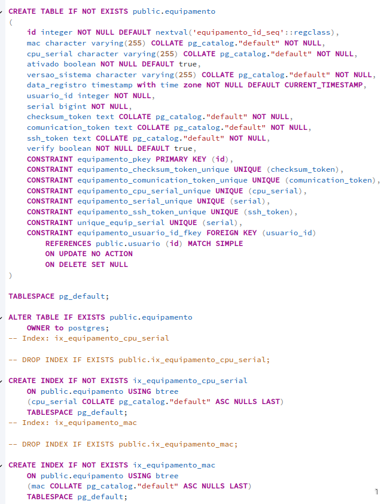
          id:: 6717b034-2dcf-4638-9b46-efba342433ef
      - Down:
        - 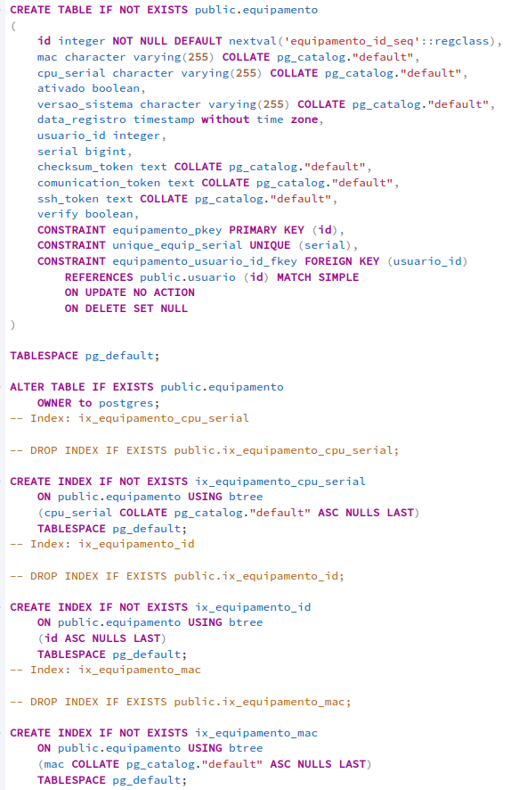
  - [FINALIZADO] SINCRONISMO DE EQUIPAMENTOS:
    - 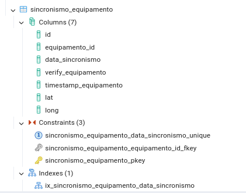
    - id
      - Já tenho a chave primária (que é como índice para o id), logo não preciso criar um índice em cima do id **_A indicação da chave primária automaticamente cria um índice para ela. Não é necessário fazer mais nada._**
        - Fonte: https://pt.stackoverflow.com/questions/147006/%C3%8Dndices-em-colunas-de-chave-prim%C3%A1ria
    - equipamento_id
      - **deve ser único?** não, o mesmo usuário pode ter mais de um equipamento.
      - **deve ser nulo?** não, ele faz parte da chave estrangeira para a tabela de usuários.
        - ```sql
          CONSTRAINT sincronismo_equipamento_equipamento_id_fkey
          FOREIGN KEY (equipamento_id)
          ```
    - data_sincronismo
      - **deve ser único?** sim, não foram encontrados registros repetidos no banco.
      - **deve ter time zone?** sim, Adicionar Time Zone
      - **valor default?** sim, default para _CURRENT_TIMESTAMP_
      - **deve ser nulo?** não, essa informação é necessária para a associação.
    - verify_equipamento
      - **deve ser único?** não, se trata de um campo booleano.
      - **deve ser nulo?** não, se trata de um campo booleano.
      - **deve ter valor default?** sim, true pois para existir associação, deve existir o equipamento.
    - timestamp_equipamento
    - **deve ser único?** não, foram encontrados registros repetidos no banco.
      - ```sql
        SELECT timestamp_equipamento, COUNT(*) AS total
        FROM public.sincronismo_equipamento
        GROUP BY timestamp_equipamento
        HAVING COUNT(*) > 1
        ORDER BY total DESC;
        ```
      - 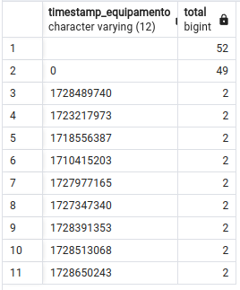
    - lat
      - **deve ser único?** não, diferentes equipamentos podem ser instalados no mesmo local
      - **deve ser nulo?** não, é uma informação importante para a associação.
    - long
      - **deve ser único?** não, diferentes equipamentos podem ser instalados no mesmo local
      - **deve ser nulo?** não, é uma informação importante para a associação.
    - IMAGES
      - Antes: 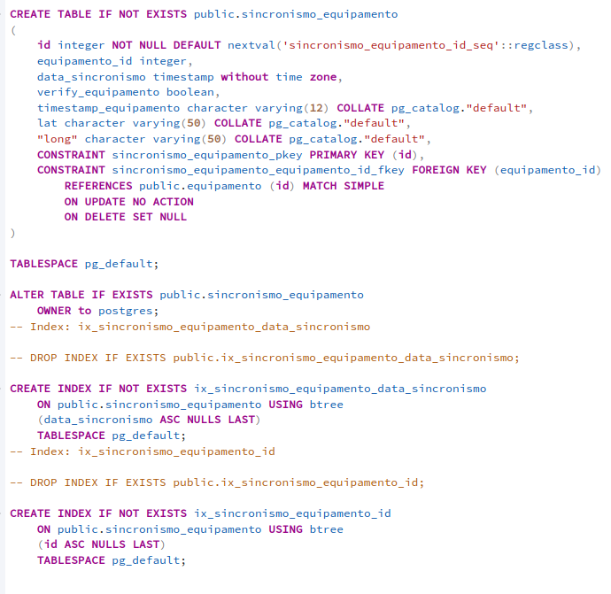
        id:: 671a639a-fa67-4961-a90e-664a52f69d87
      - Up:
        - 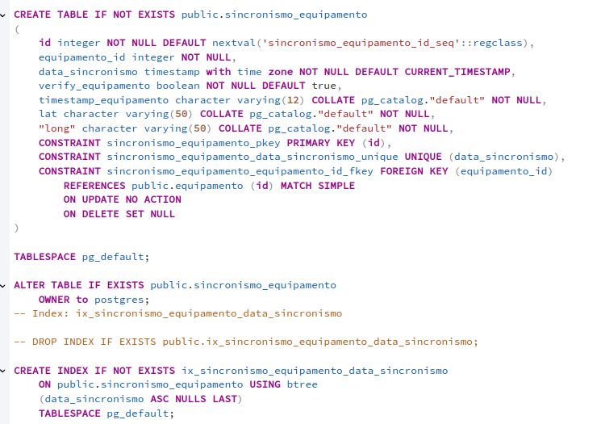
      - Down:
        - 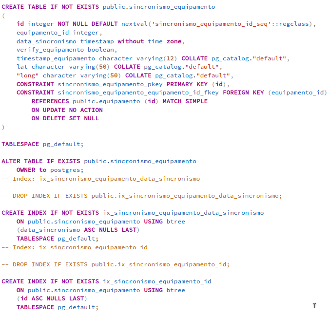
